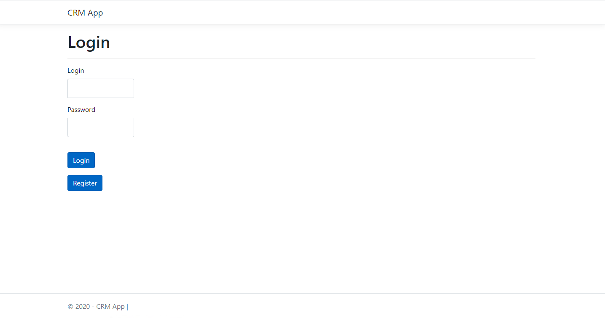
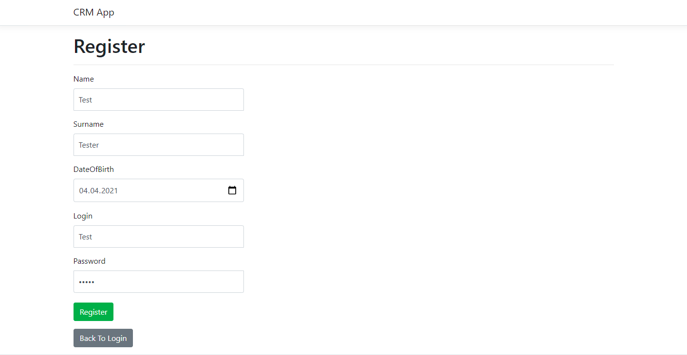
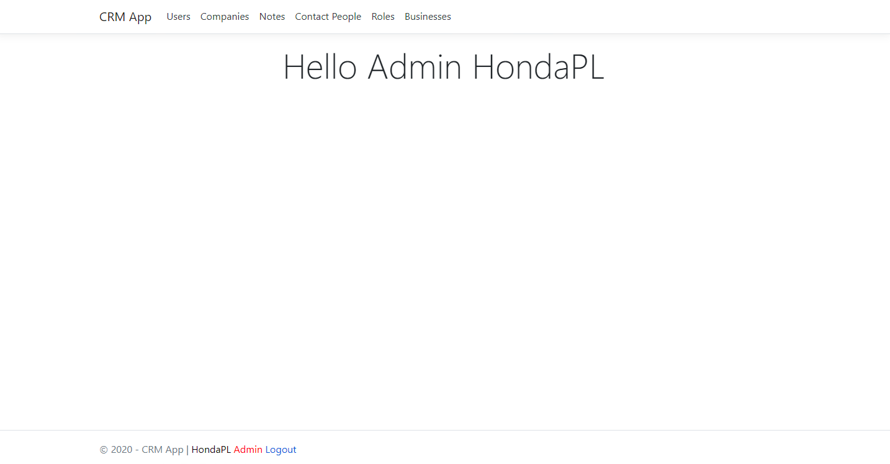
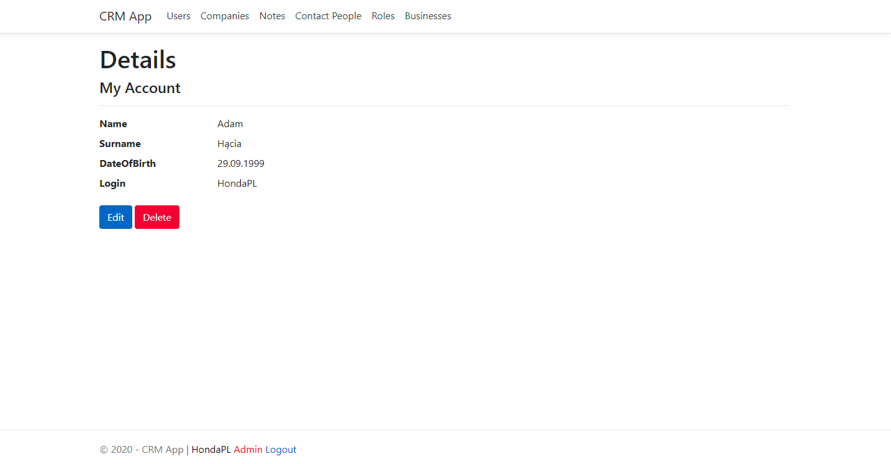
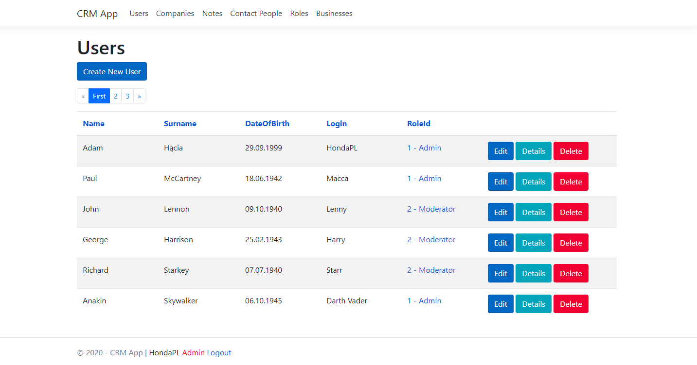
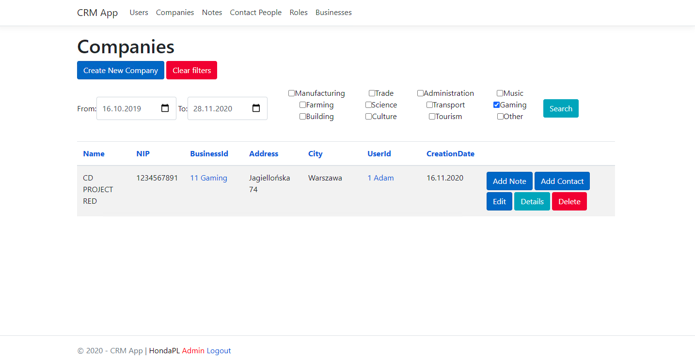
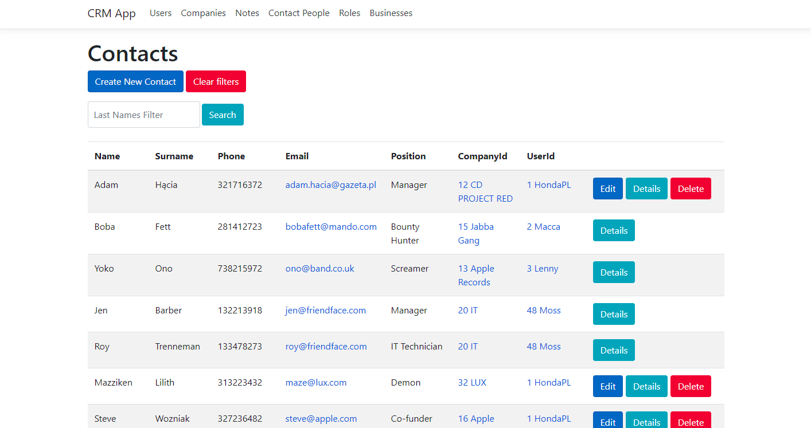
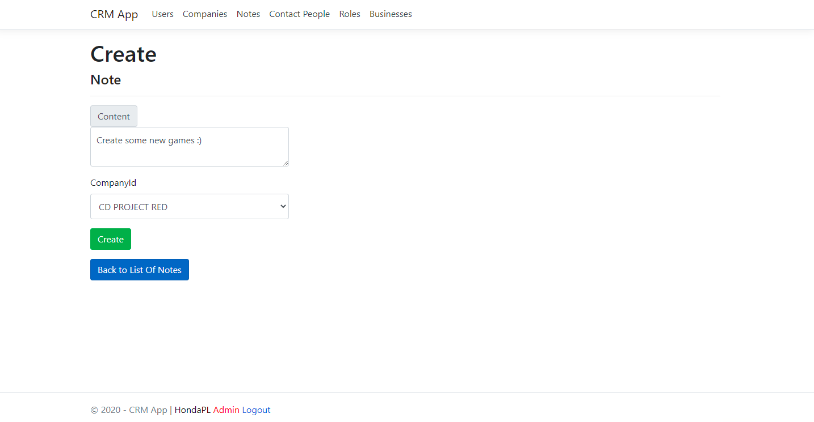
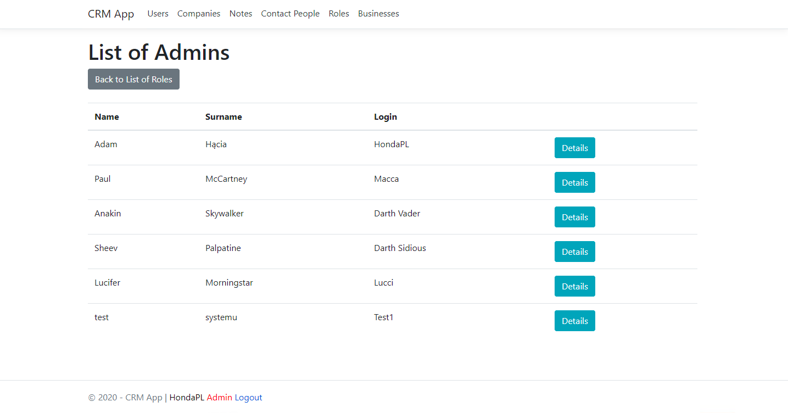
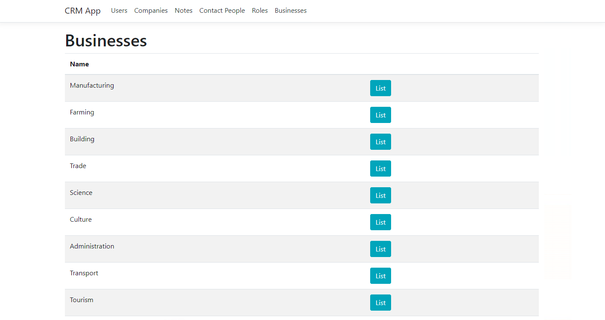

# CRM System Readme

## Overview
This CRM system is designed to manage customer relationships efficiently. You can register and explore the main functionalities without the need to integrate any database script. Simply follow the instructions below to run the application.
## Screenshots
Login page

Registration page

Landing page

My account page

Users list

Companies list with given filter

Contacts list with surname filter

Adding new note to the company

Showing list of users with specific role

Businesses list

## Instructions
0. **Project on Github**
   - Github link [https://github.com/iZainIqbal/CRMTermProject]

1. **Run/Debug the Application:**
   - Open the CRM system application in your preferred development environment.
   - Run or debug the application to start the server.

2. **Access the Application:**
   - 
   - Once the server is running, open your web browser.
   - Navigate to the application URL (e.g., http://localhost:5000,).

3. **Register/Login:**
   - Click on the "Register" link to create a new account.
   - After registration, log in using your credentials.

4. **Explore Main Functionalities:**
   - Upon logging in, explore the following main functionalities:
      - User Profile Management
      - Company and Contact Pages
      - Notes Creation for Contacts
      - Business Information Management
      - Role-Based Access Control
      - User and Admin Functionality

## Important Notes
- The application does not require any additional database integration. The provided SQLite script is for reference and can be used if needed in a different environment.
- Ensure that the necessary dependencies and tools are installed in your development environment before running the application.

Feel free to explore and test the CRM system. If you encounter any issues or have questions, refer to the application documentation or contact the development team.

Happy exploring!
